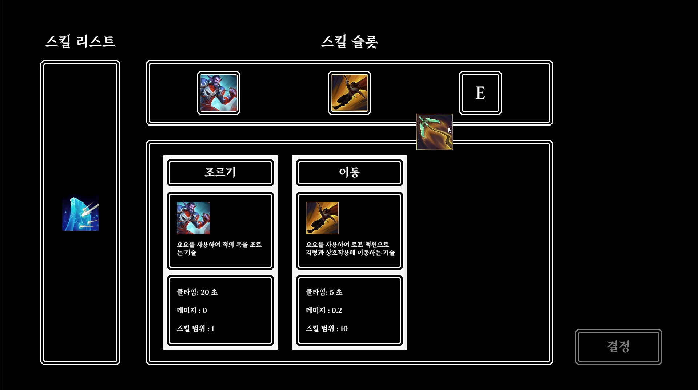
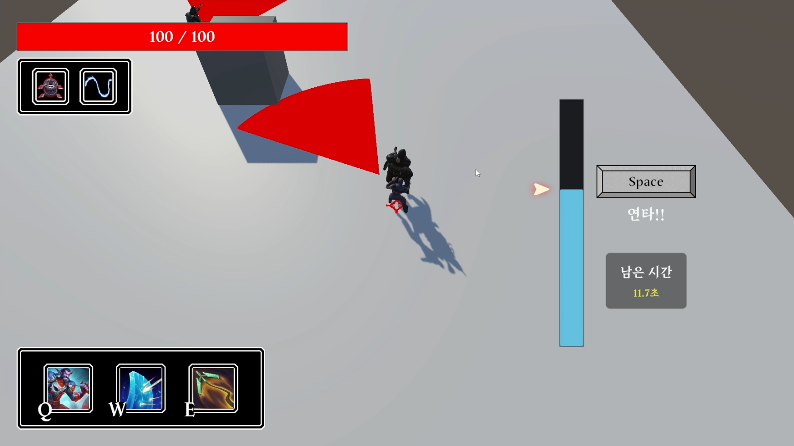

<h1>YoYoVerse</h1>
3D 잠입 액션 게임으로, 기획반과 협력하여 개발된 프로젝트입니다. 
플레이어와 적 AI 간의 상호작용에 중점을 두었습니다.

## 스크린샷

|  |  |
|:---:|:---:|
| 스킬 선택 화면 | 암살 QTE 화면 |

## 개요
- **개발 기간:** 2024.07.11 ~ 2024.07.19
- **프로젝트 유형:** 팀 프로젝트(팀장: 윤성욱, 팀원: 심준형, 석은주 및 기획반 5명 포함)

## 주요 기능
- **캐릭터 및 적 AI 관리**: 플레이어와 적 AI의 상호작용 구현.
- **상태 패턴 구현**: 상태 패턴을 통해 캐릭터와 적의 행동 관리.
- **JSON 데이터 로딩**: 게임 데이터를 JSON 파일에서 로드하여 활용.
